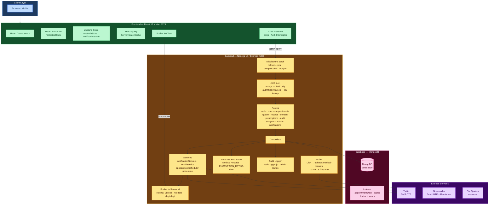
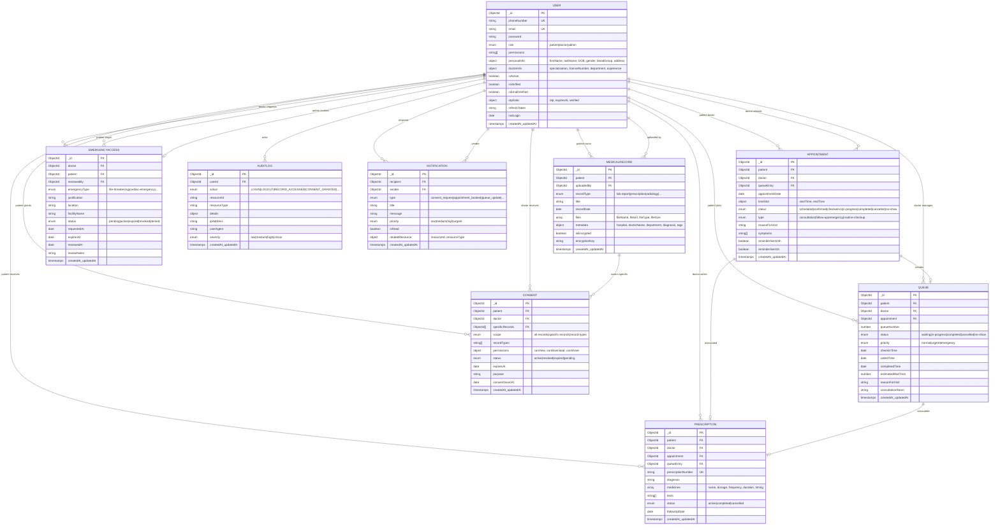
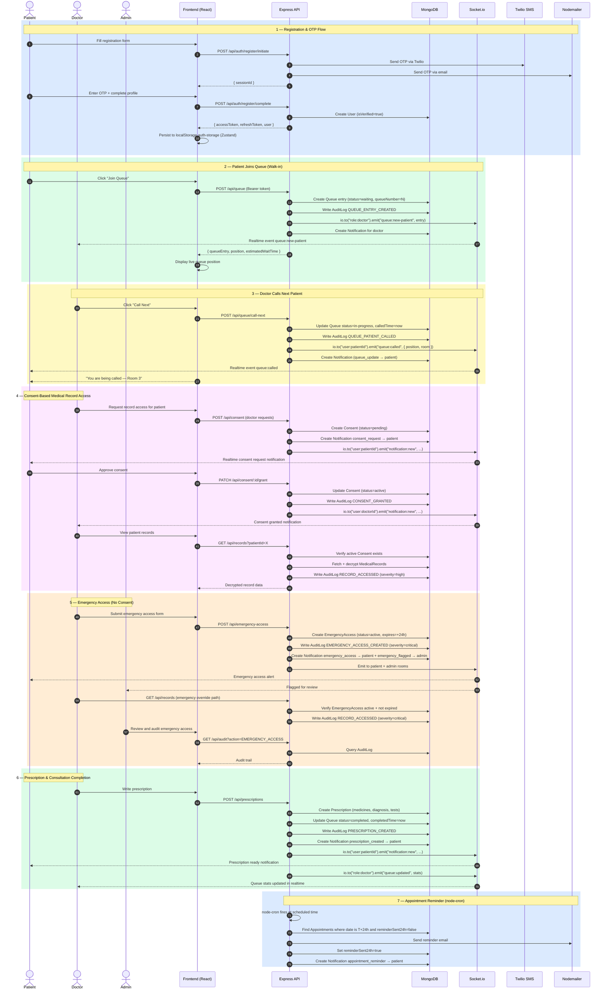
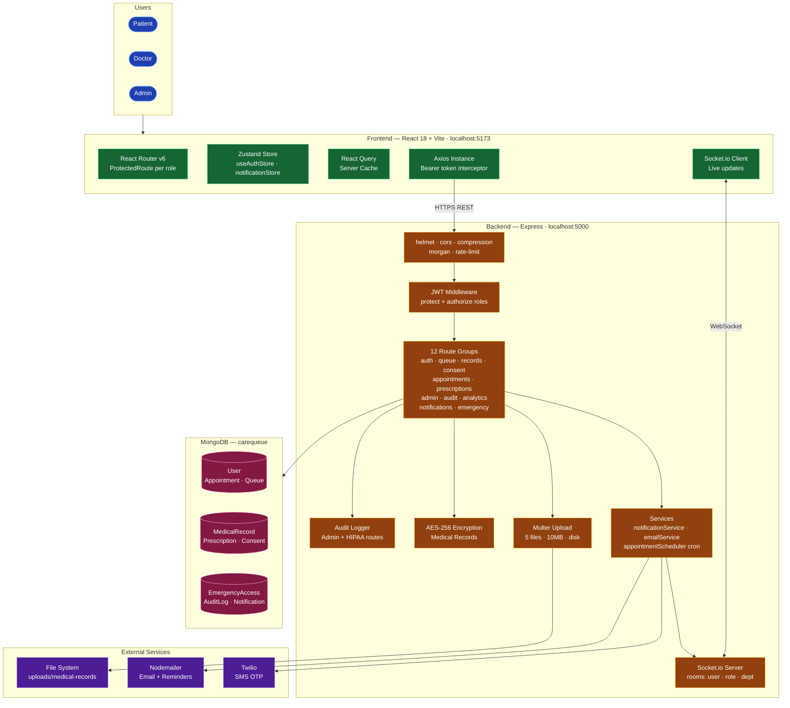
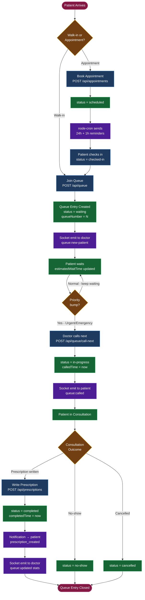
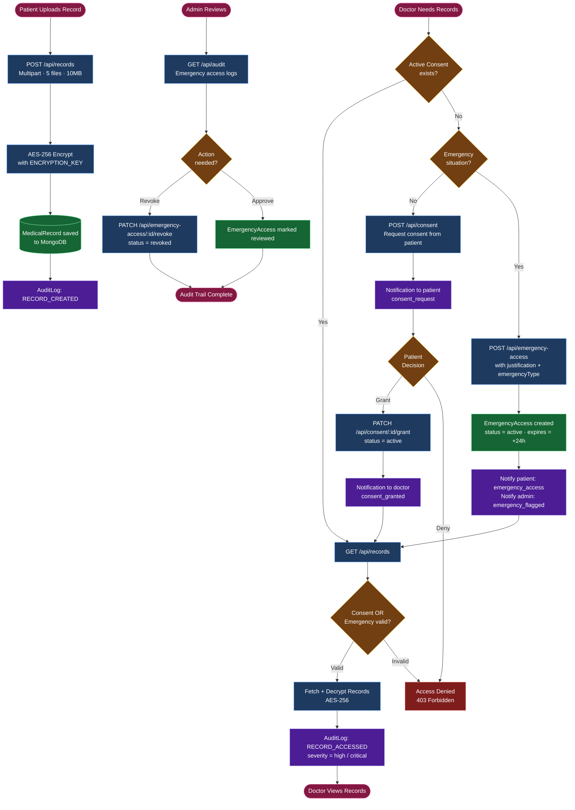

# CareQueue + Health-Vault — Project Diagrams

---

## 1. System Architecture Diagram

---

## 2. Database ER Diagram

---

## 3. Event Flow Diagram

---

## 4. System Architecture (Component View)

---

## 5. Queue Flow

---

## 6. Health Vault Flow

